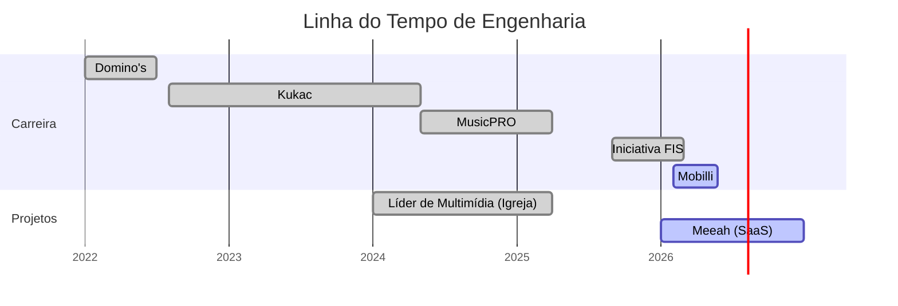

<h1 align="center">gustavo vasquez</h1>

<i>Software Engineer | Systems Architect | AI & Backend Specialist</i>

## 📊 jornada & evolução

## 👋 sobre mim

Escolhi trabalhar com tecnologia porque **amo resolver problemas**. Sou um Engenheiro de Software focado em construir sistemas que não apenas funcionam, mas que resolvem desafios de negócio com **arquitetura sólida** e **intencionalidade**.

**Como eu trabalho?**
Entendo o problema, planejo a arquitetura e implemento. Acredito que código bom não é aquele que apenas roda, é aquele que **resolve o problema e gera valor real para o negócio**.

**Minhas premissas:**
- **Execução Acima de Tudo:** Acredito fielmente que não existem limitações em tecnologia, apenas falhas de execução ou de arquitetura.
- **Arquitetura de Elite:** Aplico **Clean Architecture** e **DDD** para garantir que o software seja um ativo de longo prazo.
- **AI-Native Engineering:** Especialista em integração de LLMs (OpenAI, LangChain), busca vetorial (Qdrant) e pipelines de RAG para extração de conhecimento.

## 🚀 destaques de impacto

- **Iniciativa FIS:** Arquitetura do *FIS Knowledge Engine* e pipeline de tradução/transcrição em tempo real. Processamento de 370 painéis ao longo de 3 dias de evento (até 20 simultâneos) via Pub/Sub e GPU na GCP.
- **MusicPRO:** Otimização de pipelines de análise de áudio (20k músicas/mês), reduzindo a latência de análise de 12s para 4s.
- **Meeah (SaaS):** Desenvolvimento de um ecossistema completo para gestão de casamentos, utilizando **Next.js**, **Dokploy** e infraestrutura robusta para entregar uma experiência fluida e escalável.

## 🧠 stack tecnológica

  <!-- Backend & AI -->
  
  
  
  
  
  
  
  
  
  
  
  <!-- Frontend & Mobile -->
  
  
  
  
  
  <!-- DevOps & Infra -->
  
  
  
  

---

## 📬 vamos conversar?

Se você chegou até aqui, provavelmente gosta de conversar sobre tech, negócios ou propósito. Eu também.

[LinkedIn](https://www.linkedin.com/in/devgustavovasquez/) | [E-mail](mailto:gustavovasquez2002@gmail.com)

*"Código bom é aquele que resolve o problema e gera valor."*
